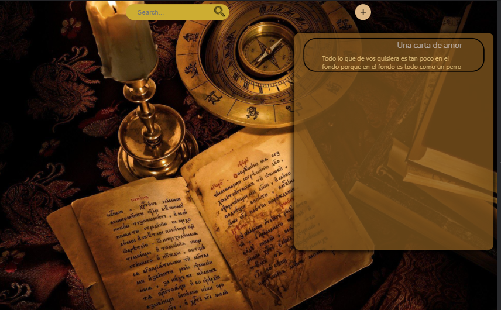
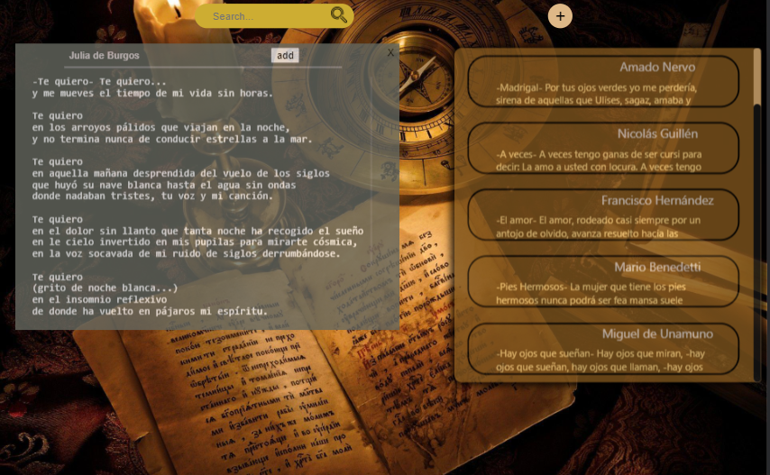
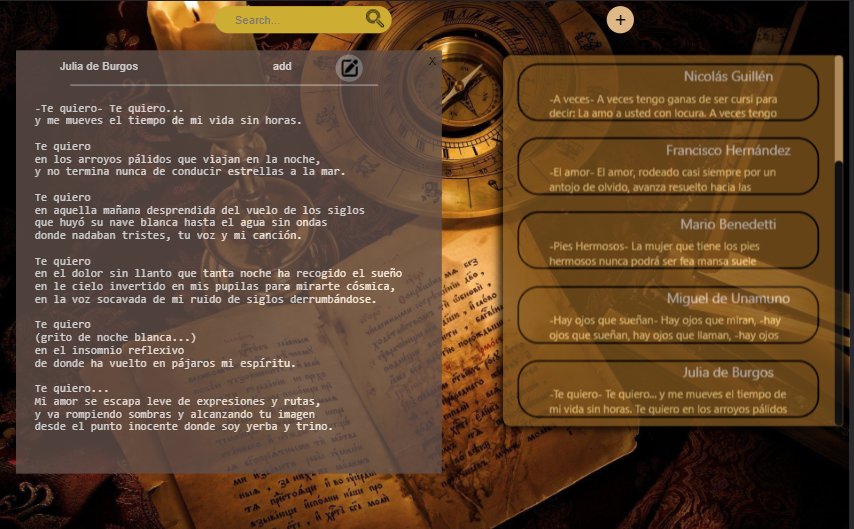

# Notes 📝

Esta aplicacion fue pensada para que los usuarios se  
sientan libres de anotar cosas para que luego no se les olvide. 
En este caso el usuario guarda notas de poemas.

<h2><u>Esta aplicaccion cuenta con</u></h2>
 

El home, donde el usuario encontrara sus notas.

 

En el caso de que quiera crear una nueva, presionando el boton de ➕
 
se abrirá un nuevo componente.

 

Si el usuario quisiera visualizar alguna nota o modificar, debera apretar  
la correspondiente y podra modificarla.

 

 
Por el momento la aplicacion se encuentra en mantenimiento.  
Luego de terminar lo dicho anteriormente, se deployara para que los usuarios puedan acceder.

